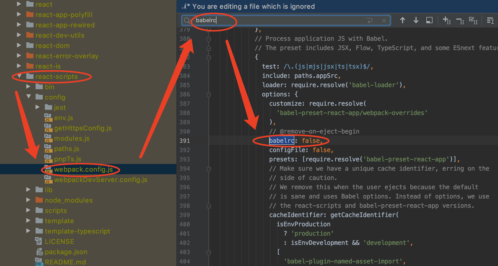

# 001-UIKit-CQDemo-React
UIKit、React


## 一、项目创建

终端执行命令顺序如下：

```
1、创建工程
create-react-app tsdemo_demo

2、进入工程
cd tsdemo_demo

3、启动工程
yarn start
```


## 二、添加路由

```
yarn add react-router-dom
```


```
// 最直接
onClick={()=>{this.props.history.push('./page1');}}

// 使用Util
onClick={()=>{DemoRouterUtil.push(this.props.history, './page1')}}>

// 使用History

```


## 三、测试CQDemoKit库

1、发库

```
npm config set registry http://registry.npmjs.org

cd xxx
npm login
npm publish
```

### 问题1：You must sign up for private packages

参考文章：

* [npm发布以@开头命名的public公有包！！！](https://blog.csdn.net/u013727805/article/details/80849329?utm_medium=distribute.pc_relevant.none-task-blog-BlogCommendFromMachineLearnPai2-1.nonecase&depth_1-utm_source=distribute.pc_relevant.none-task-blog-BlogCommendFromMachineLearnPai2-1.nonecase)
* [repository：适合写上 GitHub 地址 —— 所以你可以写成这种格式 **username/repo**](https://xiaozhuanlan.com/topic/6324159708)


```
create-react-app tsdemokitdemo

yarn add 库名

npm i -D @babel/plugin-proposal-class-properties
或
yarn add -D @babel/plugin-proposal-class-properties
```


## CREATE-REACT-APP 初始化的项目，如何启用 BABELRC 配置文件

* 参考文章：[CREATE-REACT-APP 初始化的项目，如何启用 BABELRC 配置文件](https://www.freesion.com/article/656058412/)


### 问题1：create-react-app脚手架中配置babelrc必须使用eject吗？

答：[mobile.ant.design](https://mobile.ant.design/docs/react/use-with-create-react-app-cn)官方文档中有[示例](https://mobile.ant.design/docs/react/use-with-create-react-app-cn)，用的是[react-app-rewired](https://github.com/timarney/react-app-rewired)配置loaders。babelrc应该也是可以的





[react-app-rewired](https://github.com/timarney/react-app-rewired)

```
yarn add react-app-rewired --save-dev

```

